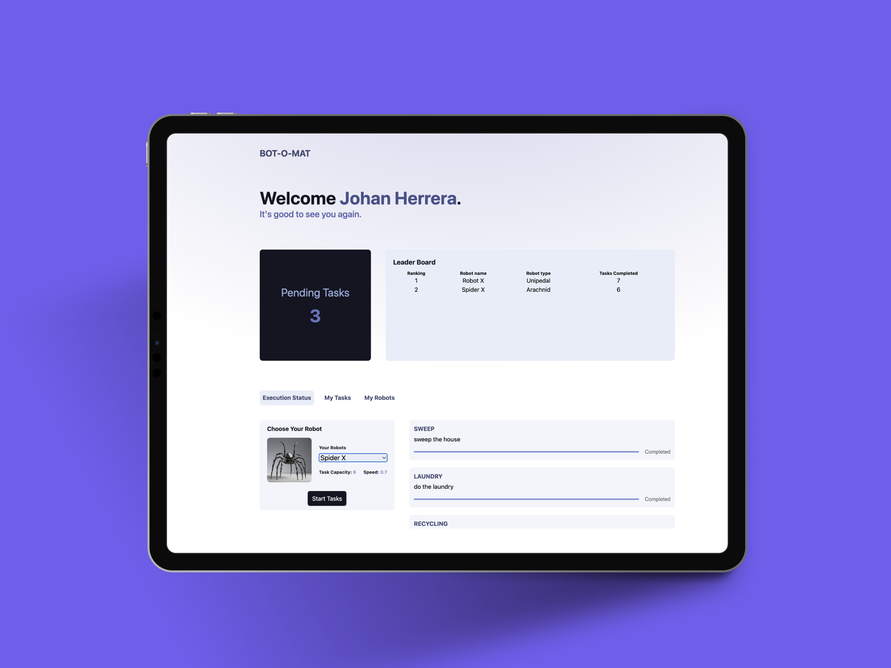

# BOT-O-MAT

## Description

BOT-O-MAT is an interactive robot task management application where users can create robots, assign tasks, and track progress in real time. The application allows users to choose a robot type, name their robot, and assign in order tasks from a list. Robots complete tasks after a set duration, and progress is visually displayed.

This project features a **modern and intuitive design** with additional functionalities, including:

- The ability to create custom robot types.
- The option to add new tasks.
- A leaderboard that tracks task completion.

## Features

### Core Functionality

- Collects a robot name and type from the user.
- Instantiates a robot of the chosen type.
- Assigns a set of five random tasks to the robot.
- Each task takes a specific time to complete and is removed from the list when finished.
- Displays a real-time progress update.

### Additional Features

- **Multiple Robot Creation**: Users can create multiple robots simultaneously.
- **Custom Robot Types**: Users can define their own robot types.
- **Custom Robot speed**: Each robot has their own speed.
- **Custom robot capacity**: Each robot has their own task capacity.
- **Custom Tasks**: Users can add new tasks to the system.
- **Leaderboard**: Tracks the number of completed tasks for each robot.

### Screen Shot



## Installation & Usage

1. **Clone the repository:**
   ```sh
   git clone https://github.com/Johanh0/RV-Technical-Assessment
   cd RV-Technical-Assessment
   ```
2. **Install dependencies:**
   ```sh
   npm install
   ```
3. **Run the application:**
   ```sh
   npm run dev
   ```

## Technologies Used

- **Frontend**: React, Tailwind CSS

## Future Enhancements

- Introduce difficulty levels for tasks.
- Develop a mobile-friendly version.
- Persistency in the tasks and robots

## Author

- [@Johanh0](https://www.github.com/johanh0)

## Support or Contact

For support or if you wish to contact me, please email me at [johanherrera20000@gmail.com](mailto:johanherrera20000@gmail.com).

You can also contact me via [LinkedIn](https://www.linkedin.com/in/johanh0/).
